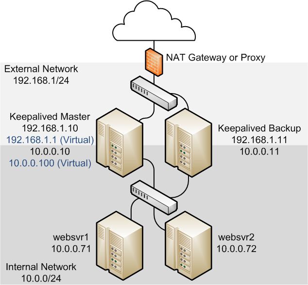
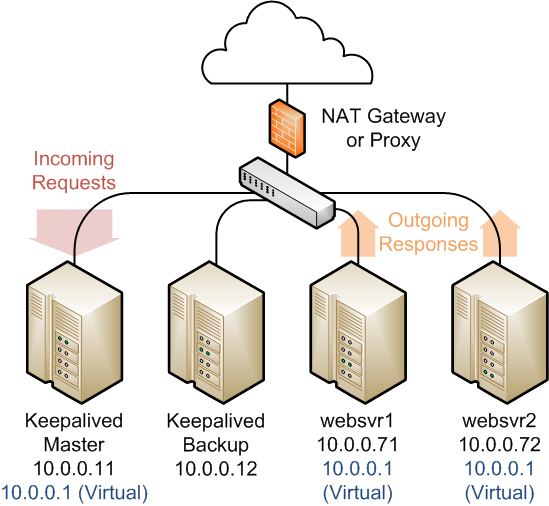

服务(器)集群，涉及的知识点相对偏OS底层些，所以想理解掌握整体的方案，需要把相关的知识点系统的掌握。  
centos7+nginx+keepalived实践，及原理分析  
centos7+lvs+keepalived实践，及原理分析  
本文尽可能的关注解决方案的整体与关键点，弱化介绍方案中各软件应用的参数配置.
   

##依赖知识点
大致可分为三块：
OS(Centos7，不同系统、版本间会有细微差异)，
网络(协议，拓扑，流向)，
应用(上层应用，如tomcat,mysql,等).

## 概念名词
Linux, Cluster, Load Balancer(LB), High Availability(HA), High Performance(HPC), Node, DNS, FailOver, VRRP
Director,RealServer, Proxy
DR,NAT,TUN,
Nginx, Keepalived, LVS, F5, IPVS, KTCPVS, NetFilter
集群，负载，高可用，负载均衡器，节点
扩展性，
二层、三层、四层交换机、路由器，反向代理，中间人
四层交换，七层交换，
Netfilter框架

## 常见问题
安装配置、启动
服务器要求/性能？
方案选型？

方案一：先介绍服务器形态，再介绍采用四层/七层交换，完成负载，介绍各种形态的方法，优劣。
方案二：由简单到复杂，先七层，后三层，先独立，后混合。

## 场景介绍

### 简单经典场景
#### 单台负载调度器 + 多台真实服务器; 负载
nginx实现负载，老版本支持七层负载，新版本也支持四层负载了。  
**参考连接：**  
[nginx负载均衡配置](https://www.jianshu.com/p/90831a94ce43)  
[nginx四层负载均衡配置代理Mysql集群](https://wuguiyunwei.com/index.php/2017/06/14/919.html)

#### 双台负载调度器 + 多台真实服务器; 主备
nginx实现负载，keepalived实现HA。  
**参考连接：**  
[Nginx+Keepalived实现站点高可用](http://seanlook.com/2015/05/18/nginx-keepalived-ha/index.html)

Nginx四层负载，工作在OS的用户空间，性能略差，但具体怎么样要测试下，还看到了付费？仔细了解一下。网上大多是以前的文章了，工作在七层。

### LVS负载场景
#### 单台负载调度器 + 多台真实服务器; 负载
**参考连接：**  
[LVS(NAT和DR)模式详细与配置](https://www.jianshu.com/p/2ed85a5204cc)  
[LVS: LVS-DR](http://www.austintek.com/LVS/LVS-HOWTO/HOWTO/LVS-HOWTO.LVS-DR.html)  
[LVS: LVS-NAT](http://www.austintek.com/LVS/LVS-HOWTO/HOWTO/LVS-HOWTO.LVS-NAT.html)  

#### 双台负载调度器 + 多台真实服务器; 主备
通常又分两种模式，NAT模式，DR模式  
**参考连接：**  
1.LVS + Keepalived NAT模式  
[17.7 Configuring Load Balancing Using Keepalived in NAT Mode](https://docs.oracle.com/cd/E52668_01/E54669/html/section_xsx_wl2_4r.html)

2.LVS + Keepalived DR模式  
[17.8 Configuring Load Balancing Using Keepalived in DR Mode](https://docs.oracle.com/cd/E52668_01/E54669/html/section_wkd_ys2_4r.html)  

#### LocalNode+单负载+多真实服务器
lvs 单负载调度器，集成在某台真实服务器，实现负载.   
1.1 NAT模式  
未尝试

1.2 DR模式  
未尝试  

#### LocalNode+两台负载负载+多真实服务器
lvs + keepalived 两台负载调度器，集成在某两台真实服务器中，实现负载及高可用。  
2.1 NAT模式  
未尝试

2.2 DR模式  
**参考连接：**  
[Building Two-Node Directors/Real Servers using LVS and Keepalived](http://kb.linuxvirtualserver.org/wiki/Building_Two-Node_Directors/Real_Servers_using_LVS_and_Keepalived)  
[LVS DR模式的一些问题](http://linbo.github.io/2017/08/20/lvs-dr)  
[Failover and loadbalancer using keepalived (LVS) on two machines -ok](http://gcharriere.com/blog/?p=339)

### 场景图说明

lvs + keepalived NAT mode:

lvs + keepalived DR mode:

## 场景详解
参见每个具体的场景介绍

独立部署步骤

* Director节点安装ipvsadm，承担LVS的负载调度能力  
* Director节点安装keepalived，负责VRRP的配置，对故障处理(Failover)实现LVS的高可用
* 在Director上配置keepalived，先后配置主/备、权重、IP负载均衡技术、调度算法、监听IP，负载IP等信息、、、、
* RealServer配置VIP，用于接收目标是VIP的网络包
* RealServer部署自己的服务应用(apache,nginx,tomcat...)
* 防火墙开启相应端口

All machines in the LVS have the VIP: only the VIP on the director replies to arp requests, the VIP on the realservers must be on a non-arping device (eg lo:0, dummy).

详细配置参见[lvs+keepalived DR]()

## 参考资料

发现好些资料都指向了[archive.linuxvirtualserver.org](http://archive.linuxvirtualserver.org/)，但这个网站显示服务器意外中断，以https访问时也显示页面不存在。